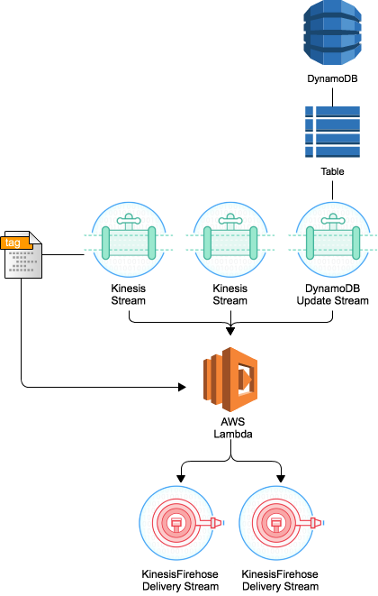

# Kinesis Streams to Kinesis Firehose Forwarder

Kinesis Streams gives customers the ability to process streaming big data at any scale with low latency and high data durability. Kinesis Firehose simplifies delivery of streaming data to Amazon S3 and Redshift with a simple, automatically scaled and zero operations requirement. Customers can also utilise the Kinesis Agent (http://docs.aws.amazon.com/firehose/latest/dev/writing-with-agents.html) to automatically publish file data to Kinesis Streams and/or Kinesis Firehose delivery streams. For those customers who are already using Kinesis Streams for real time processing, and would also like to take advantage of Kinesis Firehose for archival of their Stream data, a simple way of pushing data from a Stream to a Firehose Delivery Stream is needed.

This project contains an AWS Lambda function which does just that, without any need for customer development. It is highly efficient and preserves Stream data ordering. The target Firehose Delivery Stream is referenced by tagging the Kinesis Stream with the Delivery Stream name to forward to.




# Pre-requisites

In order to effectively use this function, you should already have configured a Kinesis Stream, as well as a Kinesis Firehose Delivery Stream, and ensured that producer applications can write to the Stream, and that the Firehose Delivery Stream is able to deliver data to S3 or Redshift. This function makes no changes to Streams or Firehose configurations. You must also have the AWS Command Line Interface (https://aws.amazon.com/cli) installed to take advantage of the Stream Tagging utility supplied

# Deploying

To use this function, simply deploy the [KinesisStreamToFirehose-1.0.0.zip](https://github.com/awslabs/kinesis-streams-to-firehose/blob/master/dist/KinesisStreamToFirehose-1.0.0.zip) to AWS Lambda. You must ensure that it is deployed with an invocation role that includes the ability to write CloudWatch Logs, Read from Kinesis and Write to Kinesis Firehose:

```
{
    "Version": "myversion",
    "Statement": [
        {
            "Sid": "Stmt1446202596000",
            "Effect": "Allow",
            "Action": [
                "logs:*"
            ],
            "Resource": [
                "*"
            ]
        },
        {
            "Sid": "Stmt1446202612000",
            "Effect": "Allow",
            "Action": [
                "kinesis:DescribeStream",
                "kinesis:ListStreams",
                "kinesis:GetShardIterator",
                "kinesis:GetRecords"
            ],
            "Resource": [
                "*"
            ]
        },
        {
            "Sid": "Stmt1446202630000",
            "Effect": "Allow",
            "Action": [
                "firehose:DescribeDeliveryStream",
                "firehose:ListDeliveryStreams",
                "firehose:PutRecord",
                "firehose:PutRecordBatch"
            ],
            "Resource": [
                "*"
            ]
        }
    ]
}
```

You may choose to restrict the IAM role to be specific to a subset of Kinesis Streams and Firehose endpoints. 

Finally, create an Event Source (http://docs.aws.amazon.com/lambda/latest/dg/wt-kinesis-configure-kinesis.html) for this function from the Kinesis Stream to be forwarded to Firehose.

# Configuration

This Lambda function uses Tag information from Amazon Kinesis to determine which Delivery Stream to forward to. To Tag the Stream for Firehose Delivery, simply run the ```tagStream.sh``` script:

```
tagStream.sh <My Kinesis Stream> <My Firehose Delivery Stream> <region>

	<My Kinesis Stream> - The Kinesis Stream for which an event source has been created to the Forwarder Lambda function
	<My Firehose Delivery Stream> - The Delivery Stream which you've configured to deliver to the required destination
	<region> - The region in which the Kinesis Stream & Firehose Delivery Stream have been created. Today only single region operation is permitted
```

This will add a new Stream Tag named ```ForwardToFirehoseStream``` on the Kinesis Stream with the value you supply. You can run the script any time to update this value. To view the Tags configured on the Stream, simply run ```aws kinesis list-tags-for-stream --stream-name <My Kinesis Stream> --region <region>```

# Optional Data Transformation

By default, the Lambda function is configured to Base64 decode the Kinesis Stream data and append a newline character, so that files delivered to S3 are nicely formatted, and easy to load into Amazon Redshift. However, the function also provides a user extensible mechanism to write your own transformers. If you would like to modify the data after it's read from the Kinesis Stream, but before it's forwarded to Firehose, then you can implement and register a new Javascript function with the following interface:

```
function(inputData, callback(err,outputData));

inputData: base64 encoded Buffer containing kinesis data
callback: function to be invoked once transformation is completed, with arguments:
	err: Any errors that were found during transformation
	outputData: Buffer instance (typically 'ascii' encoded) which will be forwarded to Firehose
```

You then register this transformer function by assigning an instance of it to the exported ```transformer``` instance:

```
var transformer = myTransformerFunction.bind(undefined, <internal setup args>);
```

You can find the built in Base64 decode and newline addition transformer as an example below:

```
exports.addNewlineTransformer = function(data, callback) {
	// emitting a new buffer as ascii text with newline
	callback(null, new Buffer(data.toString('ascii') + "\n"));
}
var transformer = exports.addNewlineTransformer.bind(undefined);
```

# Confirming Successful Execution

When successfully configured, writes to your Kinesis Stream should be automatically forwarded to the Firehose Delivery Stream, and you'll see data arriving in Amazon S3 and optionally Amazon Redshift. You can also view CloudWatch Logs (citation) for this Lambda function as it forwards streams

# Debugging & Creating New Builds

If you write a new transformer, you may wish to see debug logging in the CloudWatch Logging Stream generated for function execution. If so, then simply change 'false' to 'true' on the first line of the function:

```
var debug = false;
```

You will then need to rebuild and redeploy the function. You can do this with the ```build.sh``` script included in the repository. This will automatically redeploy the function using name 'KinesisStreamToFirehose'. If you have deployed your function as a different name, then please update this line in ```build.sh```

# Technical Bits

The Kinesis Streams to Firehose forwarding function uses the putRecordBatch interface to Firehose to send 500 messages at a time. The batches are processed serially so as to preserve the order of messages as they are received from Kinesis. All transformer functions are run in parallel and then re-ordered via the ```async.map``` function.